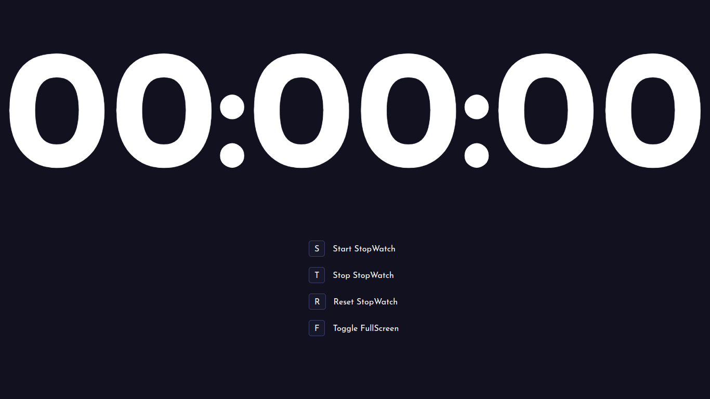

# FullScreen StopWatch

FullScreen StopWatch is a simple web app built using JavaScript. It allows you to track time conveniently with shortcut keys and provides a fullscreen mode for distraction-free timekeeping.

## Preview of the app

## Usage

- **Start Stopwatch:** Press `S` to start the Stopwatch.
- **Stop Stopwatch:** Press `T` to Stop the Stopwatch.
- **Reset Stopwatch:** Press `R` to reset the stopwatch to zero.
- **Toggle Fullscreen:** Press `F` to toggle fullscreen mode for a focused timekeeping experience.
